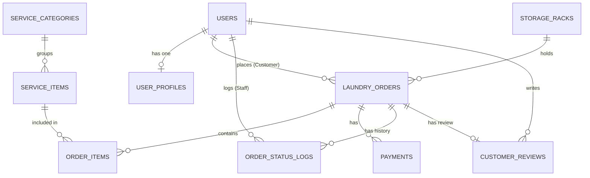

# Entity Relationship Diagram (ERD) — Laundry Express

Dokumentasi rancangan basis data dan relasi antartabel untuk aplikasi **Laundry Express**.

## Penjelasan Relasi Tabel

1. **`users` ↔ `user_profiles` (1:1)**  
   Setiap entitas pengguna memiliki 1 profil detail (NIK, kontak darurat, foto profil).

2. **`service_categories` → `service_items` (1:N)**  
   Satu kategori layanan (misal: Kiloan Regular) membawahi banyak jenis item service.

3. **`users` (Customer) → `laundry_orders` (1:N)**  
   Seorang pelanggan dapat memiliki banyak transaksi pesanan laundry.

4. **`storage_racks` → `laundry_orders` (1:N)**  
   Satu rak penyimpanan menampung banyak bungkus pesanan laundry yang sudah selesai diproses.

5. **`laundry_orders` ↔ `service_items` (N:M via `order_items`)**  
   Satu order laundry dapat berisi banyak jenis layanan (misal: cuci kiloan + cuci bedcover), dan setiap jenis layanan bisa dipesan dalam banyak order.

6. **`laundry_orders` → `payments` (1:N)**  
   Setiap order laundry dapat memiliki rincian catatan pembayaran.

7. **`users` (Customer) → `payments` (Has-Many-Through)**  
   Pelanggan dapat mengakses semua riwayat pembayaran mereka melalui model `LaundryOrder`.

8. **`service_categories` → `order_items` (Has-Many-Through)**  
   Kategori layanan dapat mengakses seluruh item transaksi yang dipesan melalui model `ServiceItem`.

9. **`laundry_orders` → `order_status_logs` (1:N)**  
   Setiap order laundry mencatat historis pergeseran status pengerjaan (Penerimaan -> Pencucian -> Pengeringan -> Penyetrikaan -> Siap Ambil -> Selesai) yang diinput oleh Staff.

10. **`laundry_orders` ↔ `customer_reviews` (1:1)**  
    Setiap transaksi order yang telah selesai memiliki 1 ulasan & rating dari pelanggan.
