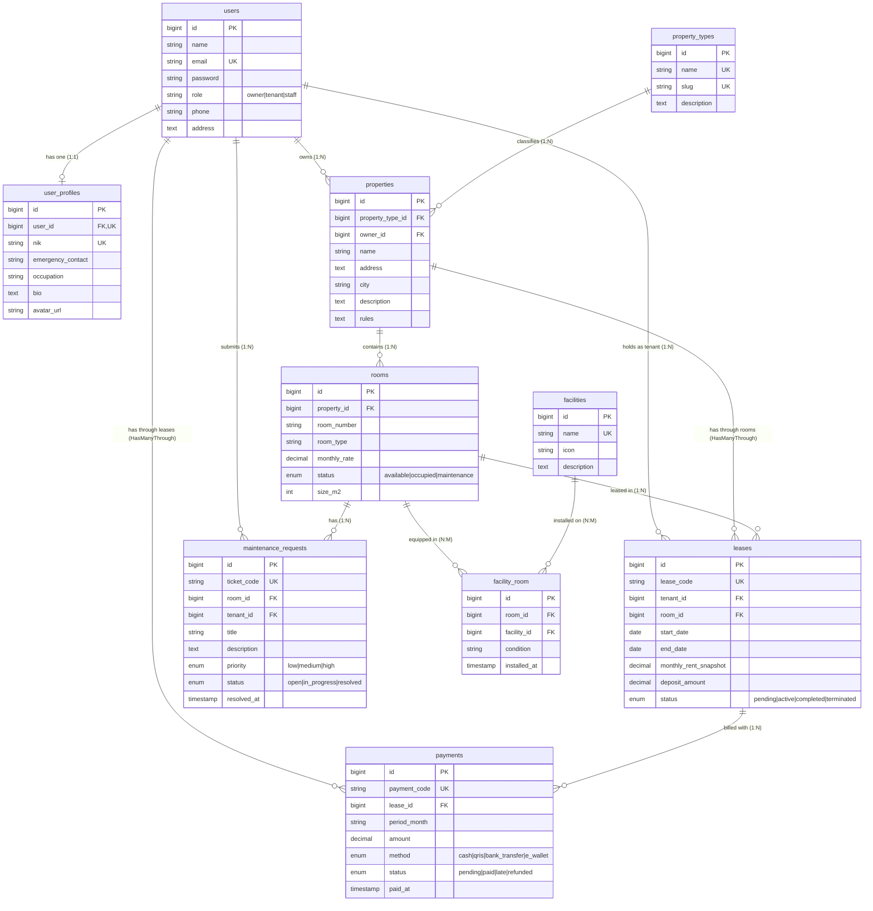

# Entity Relationship Diagram (ERD) — SmartKost (Kost & Property Management System)

> **Proyek**: SmartKost — Sistem Informasi Manajemen Sewa Kost & Kontrakan  
> **Mahasiswa**: Muhammad Ixmal Alimudin  
> **NPM**: 2410010280  
> **Kelas**: TI 5D REG BJB  
> **Mata Kuliah**: Pemrograman Berbasis Objek 2 (PBO 2) / Laravel Framework  

---

## 1. Diagram ERD (Mermaid)

---

## 2. Deskripsi Ringkas Entitas & Relasi

| No | Relasi | Tipe | Penjelasan |
|---|---|---|---|
| 1 | `User` <-> `UserProfile` | **One-to-One (1:1)** | Pengguna memiliki 1 UserProfile (NIK, nomor darurat, pekerjaan, avatar). |
| 2 | `PropertyType` <-> `Property` | **One-to-Many (1:N)** | Kategori properti (Kost Putra, Kost Putri, Kost Exclusive, dsb.) membawahi banyak properti. |
| 3 | `User` (Owner) <-> `Property` | **One-to-Many (1:N)** | Pemilik (*Owner*) dapat memiliki banyak lokasi properti kost. |
| 4 | `Property` <-> `Room` | **One-to-Many (1:N)** | Satu lokasi properti kost memiliki banyak unit kamar (*Room*). |
| 5 | `Room` <-> `Facility` | **Many-to-Many (N:M)** | Kamar dilengkapi fasilitas melalui `facility_room` dengan atribut pivot `condition` dan `installed_at`. |
| 6 | `User` (Tenant) <-> `Lease` | **One-to-Many (1:N)** | Penyewa (*Tenant*) memiliki kontrak sewa (*Lease*). |
| 7 | `Room` <-> `Lease` | **One-to-Many (1:N)** | Unit kamar disewakan dalam banyak riwayat kontrak sewa. |
| 8 | `Lease` <-> `Payment` | **One-to-Many (1:N)** | Kontrak sewa memiliki pembayaran tagihan bulanan (*Payment*). |
| 9 | `User` <-> `Payment` | **Has-Many-Through** | Mengakses seluruh pembayaran milik Penyewa melalui kontrak `Lease`. |
| 10 | `Property` <-> `Lease` | **Has-Many-Through** | Mengakses seluruh kontrak sewa di suatu Properti melalui unit `Room`. |
| 11 | `Room` <-> `MaintenanceRequest` | **One-to-Many (1:N)** | Unit kamar memiliki tiket pengaduan/keluhan perbaikan dari penghuni. |
