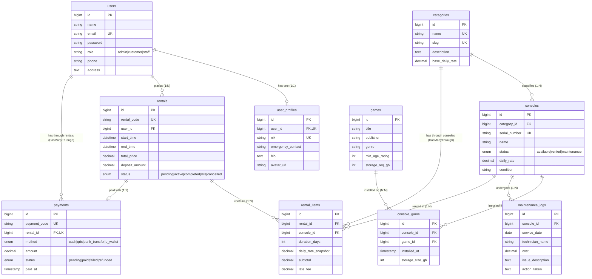

# Entity Relationship Diagram (ERD) — RentPS (PlayStation Rental System)

> **Proyek**: RentPS — Sistem Informasi Penyewaan PlayStation & Console Gaming  
> **Mahasiswa**: Muhammad Ixmal Alimudin  
> **NPM**: 2410010280  
> **Kelas**: TI 5D REG BJB  
> **Mata Kuliah**: Pemrograman Berbasis Objek 2 (PBO 2) / Laravel Framework  

---

## 1. Diagram ERD (Mermaid)

---

## 2. Deskripsi Ringkas Entitas & Relasi

| No | Relasi | Tipe | Penjelasan |
|---|---|---|---|
| 1 | `User` <-> `UserProfile` | **One-to-One (1:1)** | Setiap User memiliki 1 UserProfile detail (NIK, kontak darurat, bio, foto). |
| 2 | `Category` <-> `Console` | **One-to-Many (1:N)** | Kategori konsol (PS4 Slim, PS5 Disc, dsb.) membawahi banyak unit konsol fisik. |
| 3 | `Console` <-> `Game` | **Many-to-Many (N:M)** | Konsol memiliki banyak Game terinstall melalui tabel pivot `console_game` yang menyimpan `installed_at` dan `storage_size_gb`. |
| 4 | `User` <-> `Rental` | **One-to-Many (1:N)** | Pelanggan dapat melakukan banyak transaksi penyewaan. |
| 5 | `Rental` <-> `Console` | **Many-to-Many (N:M)** | Penyewaan mencakup konsol melalui tabel pivot `rental_items` dengan data `duration_days`, `subtotal`, dan `late_fee`. |
| 6 | `Rental` <-> `Payment` | **One-to-One (1:1)** | Setiap transaksi penyewaan memiliki 1 catatan pembayaran. |
| 7 | `User` <-> `Payment` | **Has-Many-Through** | Mengakses riwayat pembayaran milik User melalui transaksi `Rental`. |
| 8 | `Category` <-> `RentalItem` | **Has-Many-Through** | Mengakses statistik penyewaan item berdasarkan `Category` konsol. |
| 9 | `Console` <-> `MaintenanceLog` | **One-to-Many (1:N)** | Satu unit konsol dapat memiliki banyak rekam medis/log perawatan teknisi. |
